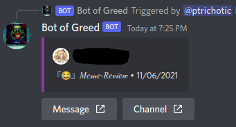
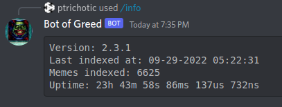
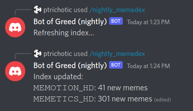

# botofgreed-rs

A Discord bot that allows you to rapidly retreive random messages from your meme channel(s)




<br/>

### Usage

The Bot of Greed provides 3 global commands:
- `/greed`: Retreives a random message from the index and reposts the attached image
- `/memedex`: Refreshes the meme index/database (not a real DB)
- `/info`: Prints information about the Bot of Greed
  - version number
  - datetime of last index refresh
  - indexed message count (meme count)
  - uptime

Each meme sent by the Bot of Greed will have two Message Component Interaction buttons:
- `I'm feeling Greedy`: Identical to the `/greed` command, just triggers the bot again
- `sauce??`: Triggers a new message which contains the information about who originally posted the image the button was attached to

### Setup using docker

#### Clone the repo

```console
> git clone https://github.com/campbellcole/botofgreed-rs.git
> cd botofgreed-rs
```

#### Build the image

```console
> ./scripts/build.sh # builds the docker image
```

#### docker-compose

```yaml
services:
  botofgreed:
    network_mode: "host"
    image: botofgreed
    volumes:
      - /some/local/path:/data
    environment:
      DISCORD_TOKEN: "your token"
      CHANNEL_IDS: "meme channels"
      DATA_FOLDER: "/data" # must match the second half of the volume
    tty: true # maybe optional? haven't tested it
    restart: unless-stopped
```

Make sure you replace the following:
- `/some/local/path` with a path to an empty folder for the bot to store data in (currently only one file named `index.json`)
- `"your token"` with your bot token
- `"meme channels"` with a comma separated list of channel ids which you want the bot to search through for memes (no trailing or leading commas)
  - You can get channel IDs by enabling developer mode in Discord then right clicking any channel; the last option will be "Copy ID"

Optionally, you can replace:
- `botofgreed:` with anything you wish to name your service (this will change your docker commands, see [Note 1](#note-1))
  - Do not change the `image: botofgreed` line
- `:/data` in the volume entry. It is recommended that you don't change this, because it's almost never necessary
  - If you change this you must also change `DATA_FOLDER: "/data"` to reflect your new volume setup

Once you have created the entry in your `docker-compose.yml` file, start it with the following command (the `-d` flag isn't technically required, see [Note 2](#note-2)):

#### Start the container

```console
> docker compose up -d botofgreed
```

#### Run the initial index



Either in a DM with your bot or in a server the bot is in, execute the slash command `/memedex`. The first time you run this, the bot will search through every message on every channel listed in `CHANNEL_IDS`, and it will save some information about any messages which contain attachments. **This will take a long time due to Discord's [rate limits](https://discord.com/developers/docs/topics/rate-limits)**.

Once the indexing is finished, the response will be edited with a number of memes collected from each channel. **The bot is now ready to use! See [Usage](#usage).**

You can use this command again at any time to refresh the index. After the initial index, it will only search through new messages, so refreshing is usually very fast.

### Updating the Bot of Greed

#### Pull the changes

In a terminal, navigate to the directory the repo is cloned in. Then, pull the changes:

```console
> git pull
```

#### Rebuild the image

```console
> ./scripts/build.sh
```

#### Stop the container, and start it again

If you changed the name of your docker service, change the commands according to [Note 1](#note-1).

```console
> docker ps # use this to find the name of the container
> docker stop <user>-botofgreed-1 # you can use tab completion to find this
> docker compose up -d botofgreed
```

#### (Optional) Prune docker images

After building the image several times, you may notice docker accumulating images. These can waste a huge amount of drive space (upwards of 10GB after just a few builds). These can be easily removed using the following command:

```console
> docker image prune # -f to skip confirmation
```

###### Note 1
If you changed the name of the service, reflect it in docker commands:
```console
> docker compose up -d <name>
> docker stop <user>-<name>-1
```

###### Note 2
You may not have to use the `-d` flag, but in general it makes things a lot easier. If you are typing these commands over SSH, it may be required. In my experience, the detach keystroke doesn't send properly over SSH so it's best to include it.

If you don't use the `-d` flag, you will need to detach from the container using <kbd>CTRL-P</kbd><kbd>CTRL-Q</kbd> (this keystroke is problematic over SSH. If it does not work, use <kbd>CTRL-C</kbd> to stop the container, and rerun the `docker compose up` command with the `-d` flag)
